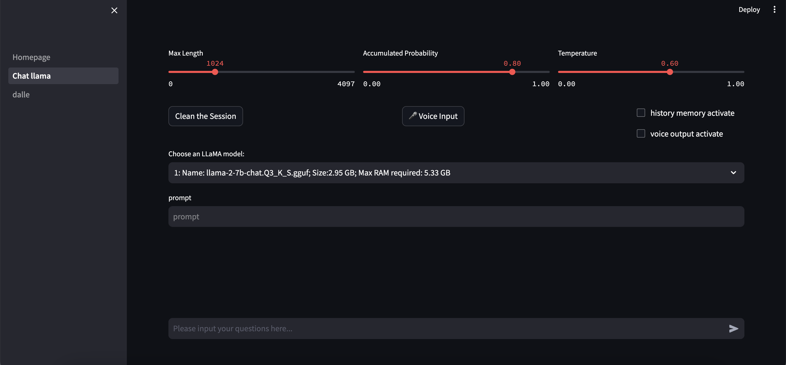
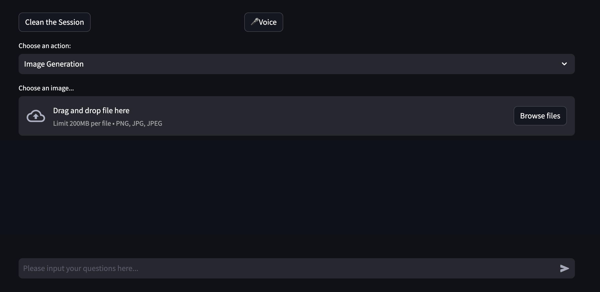

# LLaMA-2 Chatbot
We developed our dialogue system using the **Streamlit front-end framework and Longchain back-end framework**. Our dialogue system supports multimodal inputs and outputs:

1. The chat system based on the LLaMA model supports text and voice modalities for both inputs and outputs.

2. The image generation system based on Dall-E 3 supports text, voice and image inputs, and produces image outputs.
<div align="center">
    <figure>
        
    </figure>
</div>

## Download LLaMA2 Model
Visit link( https://huggingface.co/TheBloke/Llama-2-7B-Chat-GGUF#provided-files) and then download LLaMA2 chat model: 
```
1. llama-2-7b-chat.Q3_K_S.gguf
2. llama-2-7b-chat.Q5_K_M.gguf
```
Visit link(https://huggingface.co/TheBloke/CodeLlama-7B-GGUF/blob/main/codellama-7b.Q4_K_M.gguf) and then download code-LLaMA2  model:
```
codellama-7b.Q4_K_M.gguf
```
You show put all the models in ```/models/llama ```

## Get started
First, install the libraries required for our dialogue system.
```
pip3 install requirements.txt
```

Next, open the terminal in the root directory of the project and run:

```
streamlit run /Users/jiatianrun/LLM/Homepage.py --server.enableWebsocketCompression=false --server.enableXsrfProtection=false
```

There are two kinds of chatbot:

## LLaMA Chatbot
Our LLaMA Chatbot features the following functions:

1. Adjusting LLM parameters. Users can manipulate sliders to change the model's temperature, context length, and cumulative probability.
2. Model selection: Users can choose from three different LLaMA2-7b models, including 2 Llama2chat models and a Code Llama model.
3.  Support for prompt embedding, allowing users to set predetermined prompts for the Chatbot to assist in completing specific tasks.
5. Support for voice input and output, with the voice output requiring activation via a switch.
6. Memory function support, which, once enabled, allows the Chatbot to remember previous context conversations.

**Note: LLaMA2 model do not have speech modal. So we use OpenAI speech api stead. If you want to use voice output, plase set your  own OpenAI key.**

<div align="center">
    <figure>
        
    </figure>
</div>

## DALL-E Image Generator 
Since LLaMA does not possess the capability to understand visual modal semantics, in order to expand and enrich the modal functionalities of the dialogue system, we utilize the OpenAI DALL-E 3 API.

We have implemented the following features:

1. Choosing DALL-E's function: Image generation or image variation.
2. Uploading images from the local device.


**Note: If you want to use dalle-3, plase set your  own OpenAI key.**
<div align="center">
    <figure>
        
    </figure>
</div>
